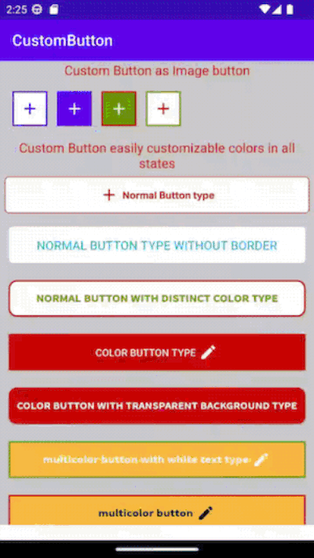
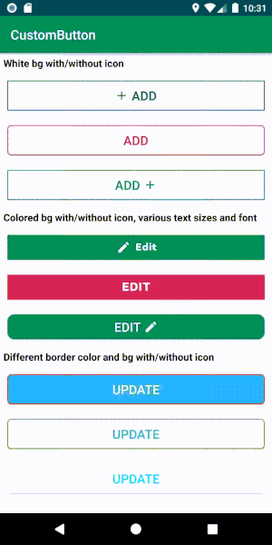
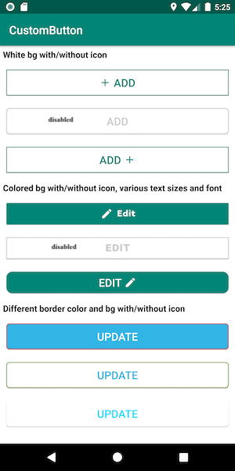
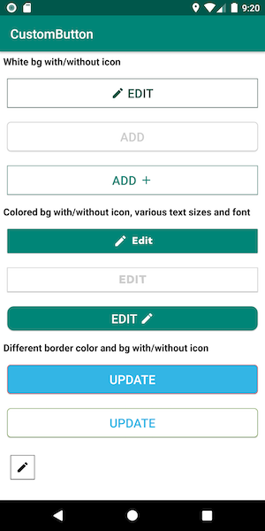

# Custom-Button-Sample
CustomButton(custom button) is an easy android library to customize button color for different button states(pressed,disabled..etc) without selector creation and also you can add left/right icon easily to it.

# Features
- Customizable button text color, size and font style.
- Customizable button size, shape, background color and border color.
- Automatically sets button color for pressed, enable and disable states.
- Easy to add icons either left or right to the button text and can set icon size also.
- Easy to change to as image button or button
- minSdkVersion 21
- targetSdkVersion 33
 
## Screenshots






## Installation

Latest version of the customButton(Custom Button) android library can be found on Maven Central.

# For Gradle users
Open your ```build.gradle``` Then, include the library as dependency:

```
implementation 'com.barelogics:sahana.customButton:1.8.1'
```

# For Maven users
Add this dependency to your ```pom.xml```:
```
<dependency>
  <groupId>com.barelogics</groupId>
  <artifactId>sahana.customButton</artifactId>
  <version>1.8.1</version>
  <type>aar</type>
</dependency>
```
## Usage

Please see the ```Custom-Button-Sample/app```  for a more detailed code example of how to use the Custom-Button android library.

1.Add the ```CustomButton``` view to the layout you want to show.
```
<com.barelogics.sahana.CustomButton
        android:id="@+id/customButton"
        android:layout_width="match_parent"
        android:layout_height="wrap_content"
        android:layout_margin="10dp"
        app:buttonType="normal_button"
        app:setColor="@color/colorPrimary"
        app:setImage="@drawable/ic_baseline_add_24"
        app:setText="Add"
        app:setTextFont="@string/bold"
        app:setTextSize="19sp"
        app:showImage="right" />
 ```    
2. **Add Fonts:**
   Add your custom fonts to ```assets/```. All font definitions are relative to this path.
  
   Assuming that you are using Gradle you should create the assets directory under ```src/main/``` in your project directory if it does not already exist. As it's   popular to use multi-project build with Gradle the path is usually ```app/src/main/assets/```, where app is the project name.

   You might consider creating a ```fonts/``` subdirectory in the assets directory (as in examples).

3. Configure attributes:
- ```setColor``` - is used to set color for the button(such as text,border and background color of the button according to the ```buttonType``` we set).

- ```setImage``` - is used to set icon drawables. Only use the ```setImage``` attribute when you have to set icon.

- ```showImage``` - is used to show/set an icon either left or right, has two values ```left``` and ```right```. By default set to ```left```.

- ```buttonType``` - is used to set different types of button. By default set to ```normal_button```. It has 7 types.

     **1. normal_button:** It is a general button.```setColor``` value will set to the **border** and **text** of the button with **white background**. On pressed state, the same ```setColor``` value will apply to the button **background with white color text**

     **2. transparent_button:** ```setColor``` value will set to the **border and text** of the button **with transparent background.** On pressed state, the same ```setColor``` value will apply to the button **background with white color text**

     **3. normal_button_with_distinct_color:** If we want to set **different colors for text and border** of the button then we should use this. ```setBorderColor``` attribute value should set along with the ```setColor```. ```setBorderColor``` value will set to the **border of the button**, ```setColor``` value will set to the **text of the button with white background**. So this button type is used **to set different colors for text and border with white background**. On pressed state, the ```setBorderColor``` value will apply to the **button background with white color text**.

     **4. color_button:** ```setColor``` attribute color value will set to the **background and border of the button with white text**. On pressed state, the same ```setColor``` value will apply to the **text of the button** with **white background**.

     **5. multicolor_button_with_white_text:** If we want to set **different colors** for **background** and **border** of the **button** then we should use this. ```setBorderColor``` attribute value should set along with the ```setColor```. ```setBorderColor``` value will set to the **border** of the button, ```setColor``` value will set to the **background** of the button with **white text**. So this button type is used to set **different colors** for **background** and **border** with **white text**. On pressed state, the ```setBorderColor``` value will apply to the **button background** with **white color text**.

     **6. color_button_with_transparent_background:** ```setColor``` attribute color value will set to the **background** and **border** of the button with **white text**. On pressed state, the same ```setColor``` value will apply to the **text** of the button with **transparent background**.

     **7. multicolor_button:** If we want to set **different colors** for **background, text and/or icon** and **border** of the **button** then we should use this. ```setBorderColor``` ```setBackgroundColor``` attribute value should set along with the ```setColor```. ```setBorderColor``` value will set to the **border** of the button, ```setBackgroundColor``` value will set to the **background** of the button ```setColor``` value will set to the **text** of the button,. So this button type is used to set **different colors** for **background, text and/or icon** and **border**. On pressed state, the ```setColor``` value will apply to the **button background** and ```setBackgroundColor``` value will apply to the **text**.
                                            
- ```setBorderColor``` - is used to set border color for the button. If we want to set **different color for button border** then we should use this. Otherwise no need to set.

- ```setBackgroundColor``` - is used to set background color for the button. If we want to set **different color for button background ,text and/or icon and border** then only use this attribute to set background color. Otherwise no need to set.

- ```setText``` - is used to set text for button.

- ```setStrokeWidth``` - is used to set border/stroke size in dp (default: 1dp ).

- ```setTextFont``` - is used to set text font(typeface).```Usage <com.barelogics.sahana.CustomButton app:setTextFont="fonts/Light.otf"/>```.
     
- ```setDisableColor``` - is used to set color for when disabled the button. By default button disabled color is gray(#cccccc). So If you would like to set your desired color for disable then you can use this.

- ```setTextSize``` - to set text size in SP.

- ```setAllCaps``` - is used to set on/off capital letters for text. `True` means capital letters on for text.

- ```android:enabled``` - is used to set enable or disable the button. `False` for disable the button.

- ```setCornerRadius``` - is used to set corner radius of the button to make rounds. By default no(zero)corner radius for button.

- ```setBottomLeftRadius```  - is used to set left side bottom of corner radius of the button to make round.

- ```setBottomRightRadius``` - is used to set right side bottom of corner radius of the button to make round.

- ```setTopLeftRadius``` - is used to set left side top of corner radius of the button to make round.

- ```setTopRightRadius``` - is used to set right side top of corner radius of the button to make round.  

- ```setImageWidth``` - is used to set icon width in dp. By default width value 25dp.

- ```setImageHeight``` - is used to set icon height in dp. By default height value 25dp.

- ```android:scaleType``` - is used to scale icon in given space.

- ```iconMarginLeft``` - is used to set left margin to icon.

- ```iconMarginRight``` - is used to set right margin to icon.

- ```iconMarginTop``` - is used to set top margin to icon.

- ```iconMarginBottom``` - is used to set bottom margin to icon.

- ```textMarginLeft``` - is used to set left margin to text.

- ```textMarginRight``` - is used to set right margin to text.

- ```textMarginTop``` - is used to set top margin to text.

- ```textMarginBottom``` - is used to set bottom margin to text.

- ```android:layout_margin``` - is used to set margin to button.

- ```setMarginLeft``` - is used to set left margin to button.

- ```setMarginRight``` - is used to set right margin to button.

- ```setMarginTop``` - is used to set top margin to button.

- ```setMarginBottom``` - is used to set bottom margin to button.
    

4. If you would like to enable/disable the button dynamically then call the below method:
````
setViewEnable(boolean isViewEnable)
Ex: mCustomButtom.setViewEnable(false);
````
5. If you would like to set text dynamically for the button then call the below method:
````
setText(String text)
Ex: mCustomButtom.setText("Your button text");
````
 
6. If you would like to set icon dynamically for the button then call the below method:
````
setImage(int imageViewResourceId)
Ex: mCustomButtom.setImage(R.drawable.ic_edit);
````

7. If you would like to set/show icon direction/position either left or right dynamically for the button then call the below method:
````
showImage(@Direction int direction)
Ex: mCustomButtom.showImage(CustomButton.Direction.RIGHT);
````
8. If you would like to set color dynamically for the button then call the below method:
````
setColor(int colorResourceID)
Ex: mCustomButtom.setColor(R.color.green);
````

9. If you would like to set border color dynamically for the button then call the below method:
````
setBorderColor(int colorResourceID)
Ex: mCustomButtom.setBorderColor(R.color.red);
````

10. If you would like to set button type dynamically then call the below method:
````
setButtonType(@Type int type)
Ex: mCustomButtom.setButtonType(CustomButton.Type.COLOR_BUTTON);
````

11. If you would like to set stroke width dynamically then call the below one of methods:
````
   setStrokeWidthInDp(int width)
            or
   setStrokeWidthInPixels(int width)
            or
   setStrokeWidth(@DimenRes int resID):-resID must be dimension resource id. it can accept any size units like DIP, PX, SP

Ex: mCustomButtom.setStrokeWidthInDp(3);  or  mCustomButtom.setStrokeWidthInPixels(3);  or  mCustomButtom.setStrokeWidth(R.dimen.stroke_width);
````
12. Call the below method to get the button text and it returns string:
    ```String text = mCustomButtom.getText();```

13. If you would like to set text margins in pixels dynamically then call the below method:
````
   setTextMargins(@Nullable Integer textMarginLeft, @Nullable Integer textMarginRight, @Nullable Integer textMarginTop, @Nullable Integer textMarginBottom)
 
Ex: mCustomButtom.setTextMargins(50,50,null,null); 
````
14. If you would like to set icon margins in pixels dynamically then call the below method:
````
     setIconMargins(@Nullable Integer iconMarginLeft, @Nullable Integer iconMarginRight, @Nullable Integer iconMarginTop, @Nullable Integer iconMarginBottom) 
Ex: mCustomButtom.setIconMargins(null,null,50,null); 
````
15. If you would like to set background color dynamically for the button then call the below method:
````
setBackgroundColour(int colorResourceID)
Ex: mCustomButtom.setBackgroundColour(R.color.red);
````
16. If you would like to set button margins dynamically then use the below methods as per you need:
    must be dimension resource id. it can accept any size units like DIP, PX, SP, to avoid you can set null
````
   setMargin(@DimenRes @Nullable Integer left, @DimenRes @Nullable Integer top, @DimenRes @Nullable Integer right, @DimenRes @Nullable Integer bottom)
 
Ex: mCustomButtom.setMargin(R.dimen.left_margin,R.dimen.top_margin,null,null); 
````

````
    setLayoutMargin(@DimenRes int resId)
    
Ex: mCustomButtom.setLayoutMargin(R.dimen.margin);
````

````
   setLayoutLeftMargin(@DimenRes @Nullable Integer resId)
 
Ex: mCustomButtom.setLayoutLeftMargin(R.dimen.left_margin); 
````

````
    setLayoutRightMargin(@DimenRes int resId)
    
Ex: mCustomButtom.setLayoutRightMargin(R.dimen.right_margin);
````

````
   setLayoutTopMargin(@DimenRes @Nullable Integer resId)
 
Ex: mCustomButtom.setLayoutTopMargin(R.dimen.top_margin); 
````

````
    setLayoutBottomMargin(@DimenRes int resId)
    
Ex: mCustomButtom.setLayoutBottomMargin(R.dimen.bottom_margin);
````

17. If you would like to set button's all corners radius dynamically then call the below method:
    Must be dimension resource id. it can accept any size units like DIP, PX, SP.
````
      setCornerRadius(@DimenRes int resId)
      
Ex: mCustomButtom.setCornerRadius(R.dimen.radius);
````

````
      setTopRightRadius(@DimenRes int resId)
      
Ex: mCustomButtom.setTopRightRadius(R.dimen.top_right_radius);
````

````
      setTopLeftRadius(@DimenRes int resId)
      
Ex: mCustomButtom.setTopLeftRadius(R.dimen.top_left_radius);
````

````
      setBottomRightRadius(@DimenRes int resId)
      
Ex: mCustomButtom.setBottomRightRadius(R.dimen.bottom_right_radius);
````
````
      setBottomLeftRadius(@DimenRes int resId)
      
Ex: mCustomButtom.setBottomLeftRadius(R.dimen.bottom_left_radius);
````


## License
``` 
Copyright 2022 Sahana B

Licensed under the Apache License, Version 2.0 (the "License");
you may not use this file except in compliance with the License.
You may obtain a copy of the License at

   http://www.apache.org/licenses/LICENSE-2.0

Unless required by applicable law or agreed to in writing, software
distributed under the License is distributed on an "AS IS" BASIS,
WITHOUT WARRANTIES OR CONDITIONS OF ANY KIND, either express or implied.
See the License for the specific language governing permissions and
limitations under the License.
```
